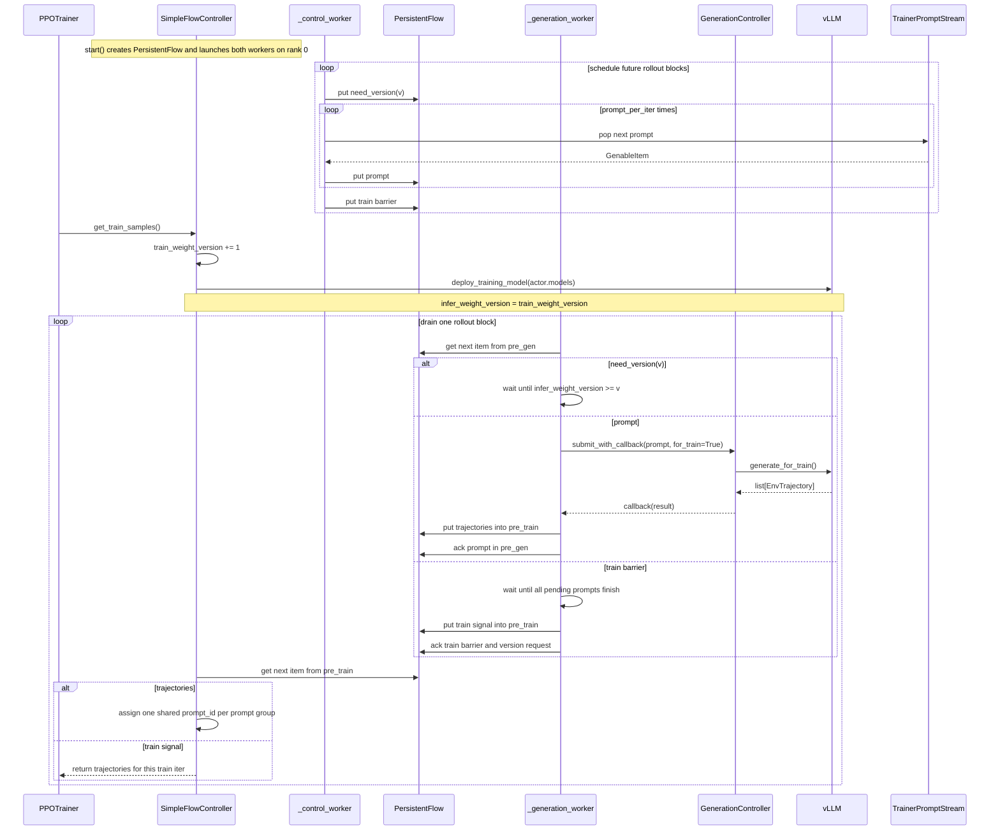
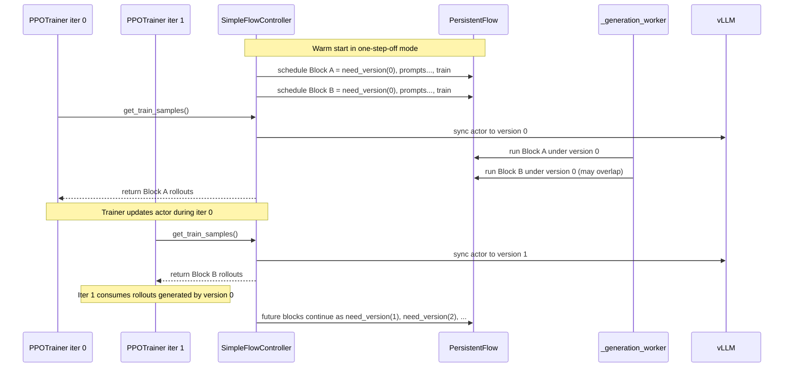

# Generators

This directory currently contains the PPO/RL rollout flow controller:
`steptronoss/core/generators/flow_controller.py`.

## What `flow_controller.py` does

`SimpleFlowController` is the rank-0 rollout orchestration layer between:

- the prompt source (`TrainerPromptStream` / dataloader),
- asynchronous generation (`GenerationController`),
- the hot-reloaded inference model (`vLLM`),
- and PPO training (`PPOTrainer`).

From the trainer's perspective, the interface is intentionally small:

- `start(...)`: attach the prompt source and actor model, then start background workers
- `get_train_samples()`: return all rollout trajectories for exactly one train iteration
- `state_dict()` / `_load_state_dict(...)`: persist and restore in-flight flow state

The trainer call path is:

`PPOTrainer.start()` -> `flow_controller.start(...)` -> background scheduling/generation
threads -> `PPOTrainer.generate_trajectory()` -> `flow_controller.get_train_samples()`.

## Runtime model

`SimpleFlowController` builds a checkpointable `PersistentFlow` with three stages:

- `source`: prompt source backed by `TrainerPromptStream`
- `pre_gen`: prompts and control signals waiting for generation
- `pre_train`: generated trajectories waiting to be consumed by training

Two daemon threads run on rank 0:

- `_control_worker()`: schedules `need_version -> prompts -> train` blocks into `pre_gen`
- `_generation_worker()`: executes those blocks, waits for the right inference
  weights, launches async generation, and pushes completed trajectories into
  `pre_train`

## On-policy timing

The most important behavior is that `get_train_samples()` is both:

- a request for the next batch of rollout trajectories, and
- a synchronization point that hot-reloads the latest actor weights into vLLM

For the default `on-policy` mode, one train iteration looks like this:

## One-step-off timing

`one-step-off` uses the same machinery, but the scheduler warm-starts with two
consecutive rollout blocks that both require inference weight version `0`.

That means:

- iter 0 still trains on rollouts generated by version `0`
- after warm-up, iter `k` usually trains on rollouts generated by version `k-1`
- meanwhile vLLM can already be hot-reloaded to version `k` before those stale
  rollouts are consumed

## Scheduling semantics

The controller uses explicit weight versions to define how fresh inference must
be before a prompt can run.

- `train_weight_version`: latest training-side actor version
- `infer_weight_version`: latest version already hot-reloaded into vLLM
- `need_version(v)`: generation barrier meaning "do not run later prompts until
  vLLM has at least version `v`"

Current strategies in `SimpleFlowController`:

- `on-policy`: scheduled version sequence is `0, 1, 2, ...`
- `one-step-off`: scheduled version sequence is `0, 0, 1, 2, ...`

In practice:

- `on-policy`: iter `k` trains on rollouts generated by version `k`
- `one-step-off`: after the initial warm-up, iter `k` trains on rollouts
  generated by version `k-1`

That is why `one-step-off` can keep one extra rollout block in flight using the
previous actor weights, while `on-policy` advances one block per weight version.

## Checkpoint / resume semantics

The flow controller is intentionally part of trainer checkpointing.

- `state_dict()` stores:
  - `train_weight_version`
  - `infer_weight_version`
  - the whole `PersistentFlow` queue state
- `PersistentQueue.state_dict()` includes both queued items and already-popped
  but not-yet-acked items, so resumes keep unfinished work instead of silently
  dropping it
- `weight_dumped()` only acks the `pre_train` items that were already handed to
  the trainer after checkpoint dumping succeeds
- `_load_state_dict(...)` resets `infer_weight_version` to `-1` on restore, so
  resume conservatively re-syncs weights to inference

## Important current limitation

`FlowControllerConfig` covers the simple `on-policy` / `one-step-off` modes.
`FullyAsyncFlowControllerConfig` owns the `fully-async`-specific knobs such as
`max_untrained_prompts` and `max_staleness`. The repo now has an initial
`FullyAsyncFlowController` implementation for that mode. It already does prompt
scheduling, async generation, version-gated weight updates, and
prompt-count-based yielding, but it is still early and should be treated as a
first pass guided by the simulator rather than a battle-tested production path.

If you extend this module, review these pieces together:

- `sync_weight()` and `VLLMDeployConfig.deploy_training_model(...)`
- `_control_worker()` scheduling and version bookkeeping
- `_generation_worker()` barrier handling
- `PersistentFlow` ack/restore behavior
- checkpoint call sites in `PPOTrainer.save_checkpoint()`
